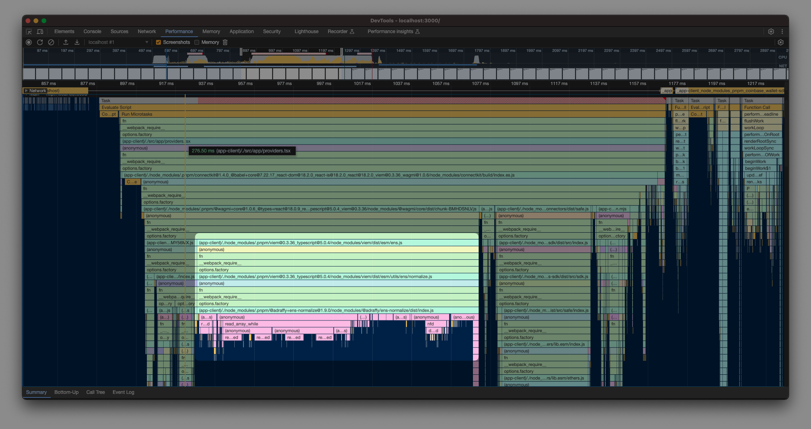

# Performance profiling

Trying to investigate initial load impacts of `wagmi`.
Before the browser can paint anything to the page, `wagmi` context seems to be doing something expensive that it takes blocking time on the main thread.

After some investigation, it seems like most of the compute is being spent on some ENS normalizations.

You can check the [performance profile](./wagmi-load.json.zip) and investigate other things.

This is concerning because we are just showing a connect button and there is no wallet connected and it seems to be crunching some time on ENS.

In an ideal world, to optimize speed we should be able to defer loading of most of things from `wagmi` until user interacts with the connect button.
